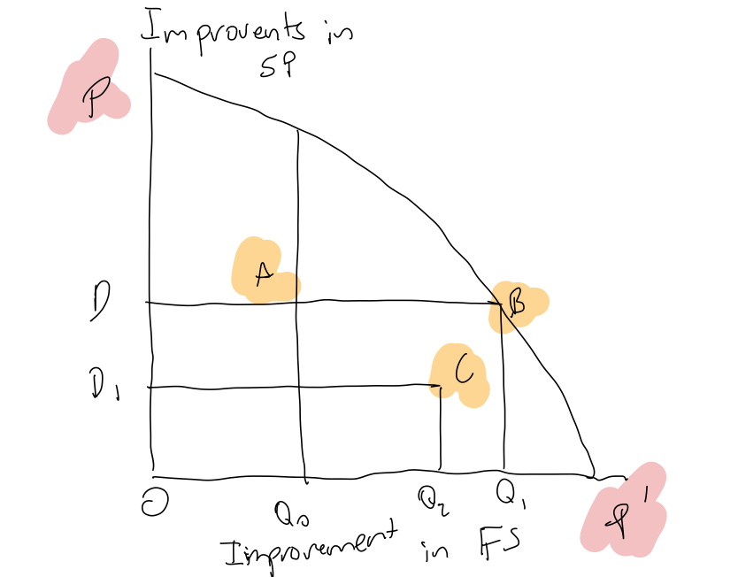
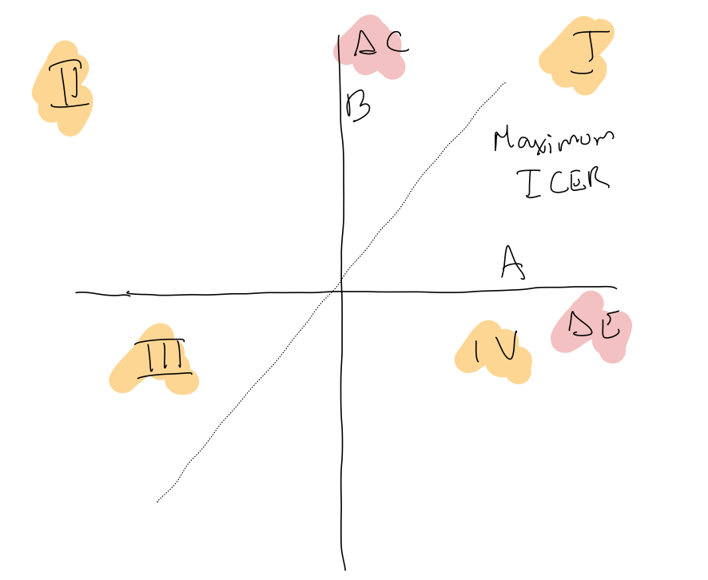
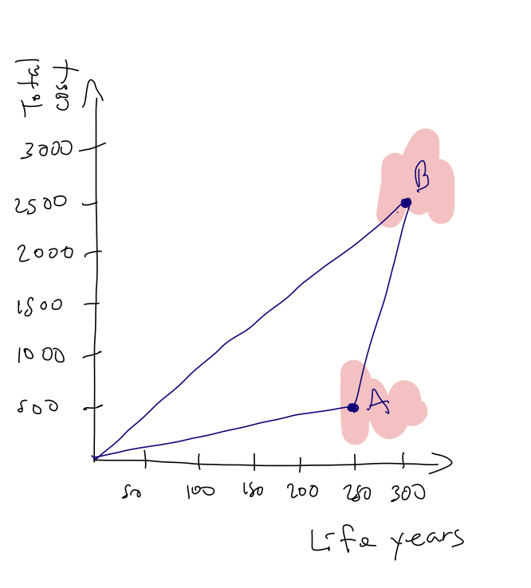

# Introduction to decision-analytic models {#decision}

## Pre-session readings

Chapter 3 of *R for data science*.

**Economic evaluation**

*Gray, A. M., Clarke, P. M., Wolstenholme, J. L., & Wordsworth, S. (2011). Applied methods of cost-effectiveness analysis in healthcare (Vol. 3). Oxford University Press.* Chapter 2. 

*Birch, S., & Gafni, A. (1992). Cost effectiveness/utility analyses: do current decision rules lead us to where we want to be?. Journal of health economics, 11(3), 279-296.* 
*Doubilet, P., Weinstein, M. C., & McNeil, B. J. (1986). Use and misuse of the term “cost effective” in medicine.*

**Decision modelling**

*Briggs, A., Sculpher, M., & Claxton, K. (2006). Decision modelling for health economic evaluation. Oxford University Press.* Chapter 2. Sections 2.1 and 2.2

*Gray, A. M., Clarke, P. M., Wolstenholme, J. L., & Wordsworth, S. (2011). Applied methods of cost-effectiveness analysis in healthcare (Vol. 3). Oxford University Press.* Chapter 2. Sections 8.1 to 8.4

*Buxton, M. J., Drummond, M. F., Van Hout, B. A., Prince, R. L., Sheldon, T. A., Szucs, T., & Vray, M. (1997). Modelling in ecomomic evaluation: an unavoidable fact of life. Health economics, 6(3), 217-227.*

## Economic evaluation

Cost-effectiveness analysis (CEA) and cost-utility analysis (CUA) have been proposed as methods for comparing alternative uses of scarce health-care resources. The difference between CEA and CUA lies in the way outputs are measured.

We can find different objectives of CEA across the literature:

*"The underlying premise of cost-effectiveness analysis in health problems is that for any given level of resources available, society (or the decision making jurisdiction involved) wishes to maximize the total aggregate health benefits conferred"* @weinstein1977foundations.

*"For any given rate of output [the combination of inputs] . that costs the decision maker least"* @culyer1980political

*"A method of determining the most efficient way of dealing with a specified health problem"* @green1988priority

The goal of CEA is to maximize health benefits produced from a given level of resources. Therefore, it is consistent with welfare economics concept of Pareto efficiency [@birch1992cost] (Figure \@ref(fig:fig1)).

```{r fig1, echo=FALSE, fig.cap="Production possibilities frontier",fig.align='center'}

```

In practice, CEA **relaxes the constraint on available resources**. Because the focus of the evaluation is not a fixed resource pool, but a specific programme making demands on resources, the comparison of the programme under evaluation with an existing programme (e.g., services aimed at improving FS) must consider not only the inter-programme differences in outputs (incremental benefits), but also the inter-programme differences in resources used (incremental costs). 

@weinstein1977foundations state that: *"the criterion for cost-effectiveness is the ratio of the net increase of health-care costs to the net effectiveness. The lower the value of this ratio, the higher the priority in terms of maximizing benefits derived from a given health expenditure"*. Issue is that applying a ratio does nod lead to the maximization of benefits from a fixed resource pool (movement from A to C in Figure). **The real problem of the application of CEA is the failure to adhere strictly to the notion of opportunity cost in the measurement of the (incremental) cost of a programme.** The existing programme represents a true opportunity cost for the entire resource requirements of the new programme, even though it does not absorb this level of resources.

### Cost-effectiveness in practice

As mentioned before, CEA include both costs and effects, which are represented graphically in a plane:

```{r fig2, echo=FALSE, fig.cap="Incremental CE plane",fig.align='center'}

```

**Questions**

1. Describe the plane.
2. What is the willingness-to-pay in this plane?
3. What type of uncertainties are encountered in this plane?

Why incremental? We can see it using the example from @gray2011applied applied to mutually exclusive options (see Figure \@ref(fig:fig3)):

+ Diet and excercise (C): Reference
+ Metformin (A): $500k/250 life-years
+ New drug (B): $2500k/300 life-years


```{r fig3, echo=FALSE, fig.cap="Average and incremental cost-effectivenessr",fig.align='center'}

```

Clearly, as this example shows, it is quite misleading to calculate average cost-effectiveness ratios, as they ignore the alternatives available.

**Questions**

1. What is the difference between average cost-effectiveness ratios vs incremental?

The idea of CEA is to maximize health benefits with the available resources, which in terms of the CE plane represents pushing as far to the right as possible while moving up the vertical axis as little as possible. The next example from @gray2011applied shows the ideas behind **cost-effectivness frontier, dominance, extended dominance** (Table \@ref(tab:table2)).

```{r table2, echo=FALSE, message=FALSE, warnings=FALSE, results='asis'}
options(knitr.kable.NA = '')
read_csv("misc/table2_1.csv") %>% 
  kable(caption="Calculating incremental cost-effectiveness",format.args = list(big.mark = ","))
```

Once we have the ICERs for different independent programmes. How can we maximize health gains with this information? Note that now we are comparing different programmes as opposed to mutually exclusive options. Let's work in the next example:


```{r table3, echo=FALSE, message=FALSE, warnings=FALSE, results='asis'}
options(knitr.kable.NA = '')
read_csv("misc/table2_2.csv") %>% 
  kable(caption="Using cost-effectiveness to maximize health gain",format.args = list(big.mark = ","))
```

Finally, we can ask ourselves. What is the maximum value of the incremental cost-effectivess ratio ($\lambda$)?

+ Rule-based approaches - Adopting arbitrary thresholds. For example, @laupacis1992attractive adopted identical cut-off points of CAN\$20,000 per QALY gained, up to which level they considered that there would be strong grounds for adoption, and CAN\$100,000 per QALY gained, above which they considered that evidence for adoption was weak. An alternative approach is to use the country's gross domestic product (GDP) per capita. @williams2004could advanced one line of reasoning in support of this, arguing that each
person has an entitlement to a ‘fair share’ of the country’s wealth.

+ League table approach - If we had full information on the ICERs of all available interventions, it would be possible to rank them by ICER. See the example in Table \@ref(tab:table2). 

What are the issues with these approaches?

1. $\lambda$ is a function of the budget. Therefore it is constantly changing
2. The dynamic nature of $\lambda$. As new programs are funded and others replaced, the identification of the last program funded changes.

### Conclusions

+ Irrespective of whether the problem face by decision-makers is simple (maximizing health gains from available resources) or complex (subject to considerations of equity, accessibility, etc.), if it is not to be considered in the context of a resource constraint there is little use for economics in the way the problem is considered.

+ Other approaches have been considered, such as methods in linear programming, which is consistent with the objective of CEA.

$$
\max_{x_i,\dots,x_n}\sum_{i=1}^n x_iE_i\\
\text{s.t.}\ \ \ \ \ \sum_{i=1}^n x_ic_i\leq C
$$

where $x_i$ is the health intervention presented as a binary outcome (1 or 0), $E_i$ is the present value of the health benefits (measured using QALYs) generated by programme over the planning period, and $c_i$ is the present value of the cost of providing programme $i$ over the planning period.

## Decision modelling

HTA is undertaken in order to inform decision-making regarding the appropriate use of particular healthcare programs and interventions, and involves the synthesis of a range of evidence. Broadly speaking, this implies two important components of this process:

1. Gathering evidence for the disease and technology of concern from a range of primary studies. This includes effectiveness, costs, epidemiology, natural history of the disease, quality of life, etc. 

2. Synthesizing the evidence found in the first component in order to inform policy and decision-making.

Because of the nature of these two components, decision-analytic modelling has played an important role in HTA. This is because it represents an explicit approach to synthesizing currently available evidence regarding the effectiveness and costs of alternative (mutually exclusive) healthcare strategies [@philips2006good]. Therefore one of the main objectives of decision-analytic modelling is to address the relationship between the effectiveness and costs of alternative healthcare strategies in order to assess relative cost-effectiveness (CE) and to determine which options should be adopted given existing information [@philips2006good]. Consequently, modelling in the context of HTA is a typical problem of decision-making under uncertainty. 

Traditionally randomised controlled trials (RCTs) have been a key component of many HTA process. This is because randomsation protects against selection bias and confounding. Nevertheless, the information produced by RCTs can be limited with respect to evaluating health care as delivered in the real world. This can be because:

1. Not all interventions to be compared are included in the trial.
2. Not enough follow-up.
3. Not enough flexibility (controlled trial).
4. Small sample sizes.
5. Patients in trial are not representative to the target population.

Consequently, it is advised that HTA submissions incorporate information from as many sources as possible to address some of these problems [@sculpher2006whither]. As mentioned before, decision analytical models allow for the synthesis of information across multiple sources and for the comparison of multiple options that might not have been included as part of an RCT.

Briefly, @dahabreh2016guidance consider some potential goals of modelling in a health-care context:

- To structure investigators’ thinking and to facilitate the communication of data, assumptions, and results.
- To synthesize data from disparate sources.
- To make predictions.
- To support causal explanations.
- To inform decision making.

Moreover, they also distinguish different stages for the development of a  decision analytic model

1. Define a question
2. Decide on the type of decision model most appropriate
3. Conceptualize the model (and its mathematical structure).
4. Gather all the evidence required for the model and synthesize it.
5. Implement and run the model.
6. Assess the model.

The development of models, especially those trying to explain complex phenoma and informing difficult decisions, is a demanding task. Choosing between alternative modeling approaches can be difficult because the correct choice would not be obvious at early stages in developing a decision analytical model. In general, modelling is most useful when data have limitations (e.g. non-randomised evidence, sparse evidence, etc.), when the research question is complex and when choices are preference laden [@dahabreh2016guidance]. Another important aspect when choosing between modelling approaches is whether the model in question is likely to show results that the  intended audience will consider credible and useful. Multiple iterations are typically needed between the key activities outlined previously because at each activity the need for changes at earlier stages may become evident.

### Importance of decision-analytic models in HTA

When doing a cost-effectiveness analysis in the context of HTA, one usually starts conceptualizing the model that will help answer the research question. But what is a model? A model a simplified representation of reality [@roberts2012conceptualizing], where inputs from different sources inform it and its purpose, in the context of HTA, is to inform medical decisions and health-related resource allocation questions [@roberts2012conceptualizing].

Methods for the conduct of decision-analytic modelling have continued evolving to address the ever-increasing information needs of decision makers. The complexity and continued advances of the relevant methods have spurred the publication of recommendation statements on “best practices” for modeling in the context of HTA [@roberts2012conceptualizing; @briggs2012model]. Some of these modelling techniques [@caro2012modeling] include:

- Decision-tree models.
- State-transition models.
- Micro-simulation models.
- Discrete event simulation (DES) models.
- Dynamic transmission models.


