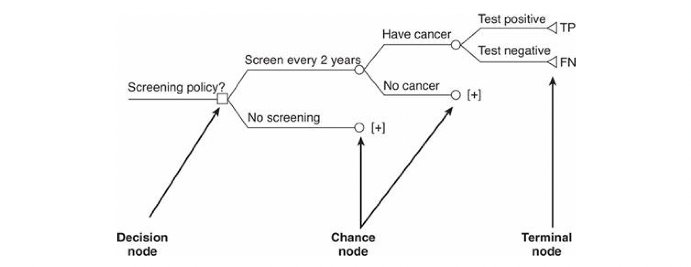
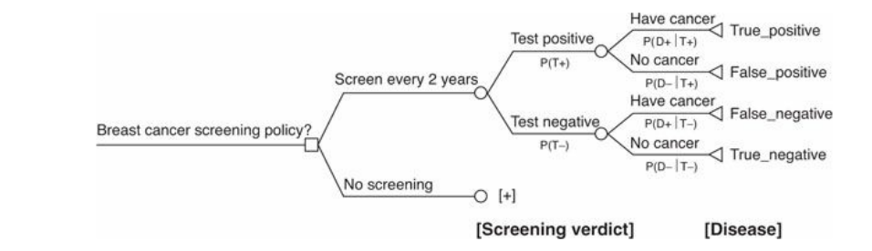

# Good practices in decision modelling and decion-tree models {#tree}

## Pre-session readings

**Good practices**

*Roberts, M., Russell, L. B., Paltiel, A. D., Chambers, M., McEwan, P., & Krahn, M. (2012). Conceptualizing a model: a report of the ISPOR-SMDM modeling good research practices task force–2. Medical Decision Making, 32(5), 678-689.*

**Decision-tree models**

*Tarride, J. E., Blackhouse, G., Bischof, M., McCarron, E. C., Lim, M., Ferrusi, I. L., ... & Goeree, R. (2009). Approaches for economic evaluations of health care technologies. Journal of the American College of Radiology, 6(5), 307-316.*

*Briggs, A., Sculpher, M., & Claxton, K. (2006). Decision modelling for health economic evaluation. Oxford University Press.* Chapter 2. Sections 2.2 and 2.3.1.

*Gray, A. M., Clarke, P. M., Wolstenholme, J. L., & Wordsworth, S. (2011). Applied methods of cost-effectiveness analysis in healthcare (Vol. 3). Oxford University Press.* Chapter 8. Sections 8.5 and 8.6.

## Good practices in decision modelling

Best practives according to @roberts2012conceptualizing:

1. The modeling team should consult widely with subject experts and stakeholders to ensure that the model represents disease processes appropriately and adequately addresses the decision problem.
2. A clear, written statement of the decision problem, modeling objective, and scope should be developed. This should include disease spectrum considered, analytic perspective, target population, alternative interventions, health and other outcomes, and time horizon.
    + A model’s scope and structure should be consistent with, and adequate to address, the decision problem and policy context.
    + The analytic perspective should be stated and defined. Outcomes modeled should be consistent with the perspective. Analyses that take a perspective narrower than societal should report which outcomes are included and excluded.
    + The target population should be defined in terms of features relevant to the decision (e.g., geography and patient characteristics, including comorbid conditions, disease prevalence, and stage).
    + Health outcomes, which may be events, cases of disease, deaths, life years gained, quality-adjusted life years, disability-adjusted life years, or other measures important to stakeholders, should be directly relevant to the question being asked.
    + Interventions modeled in the analysis should be clearly defined in terms of frequency, component services, dose or intensity, duration, and any variations required for subgroups and should include standard care and other strategies routinely considered and in use.
3. Although data are essential to a model, the conceptual structure should be driven by the decision problem or research question and not determined by data availability.
    + The choice of comparators crucially affects results and should be determined by the problem, not by data availability or quality. All feasible and practical strategies should be considered. Constraining the range of strategies should be justified
    + The time horizon of the model should be long enough to capture relevant differences in outcomes across strategies. A lifetime time horizon may be required.
4. The problem conceptualization should be used to identify key uncertainties in model structure where sensitivity analyses could inform their impact.
5. The policy context of the model should be clearly stated. This includes the funder, developer, whether the model is for single or multiple application, and the policy audience.
6. An explicit process (expert consultations, influence diagrams, concept mapping, or similar method) should be used to convert the problem conceptualization into an appropriate model structure, ensuring it reflects current disease knowledge and the process modeled.
7. Several model types may be suitable. Some problems are more naturally represented in some types than others.
    + For simple models or problems with special characteristics (e.g., very short time horizons, very few outcomes), a decision tree may be appropriate.
    + If the conceptualization involves representing the disease or treatment process as a series of health states, state-transition models are appropriate. Their primary disadvantage, the Markovian assumption that transition probabilities do not depend on history, can be addressed by increasing the number of states. Individual state-transition models, which do not require this assumption, are an alternative when the number of states grows too large.
    + When the disease or treatment process includes interactions between individuals, the methods should be able to represent those interactions and evaluate their effects.
    + When the problem involves resource constraints, the modeling method should be able to represent them and evaluate their effects.
    + For some problems, combinations of model types, hybrid models, and other modeling methodologies are appropriate.
8. Model simplicity is desirable for transparency, ease of analysis, validation, and description. However, the model must be complex enough to ensure that differences in value (e.g., health or cost) across the strategies considered are faithfully represented. Some degree of model complexity may be desirable to preserve face validity to clinical experts. Greater complexity may be necessary in policy models that are intended to be used for many problems.

## Decision-tree models

A decision-tree, is a branching structure in which each branch represents an event that may take place in the future. Identifying alternatives and specifying the sequence and linkage of events are essential steps in constructing such a model, but are also in themselves of great value in clarifying complex decisions.

### Structure and order

A hypothetical policy question concerning whether to introduce a breast cancer screening programme. It can be represented as:

```{r tree, echo=FALSE, fig.cap="Decision problem, decision node, chance nodes, terminal nodes, and branches. Source: Gray et al., 2016",fig.align='center'}

```

+ Decision trees are by convention constructed from left to right, starting with the decision node and ending with the outcomes on the right, and follow the logical structure of the decision problem, usually following the sequence of events over time.
+ Moving from left to right along the decision tree, the addition of chance nodes corresponds to the addition of subsequent uncertain events.

In general, the order of the events in the decision tree usually follows the sequence of events over time according to the logical progression of the decision pathway. We can look at the next example:

```{r tree2, echo=FALSE, fig.cap="Structure of the tree: process ordered Source: Gray et al., 2016",fig.align='center'}

```

### Probabilities in a tree

+ Once the structure of the model has been developed, the next step in the process is to start populating the model.
+ Probabilities are usually derived from published studies. When there is more than one source of information on a probability, information will need to be synthesized.
+ Probabilities (branch probabilities) are entered under the branches emanating from a chance node to represent the probability/likelihood of the uncertain event occurring. Since the events at a chance node must be mutually exclusive and exhaustive, the sum of the probabilities at each chance node must equal 1.

### Payoffs

+ Payoffs include the costs related to the events in the decision tree and the final outcomes (life-years, utilities, quality-adjusted life-years), and are entered at the terminal node.

### Expected value

+ The decision tree is ‘averaged out’ and ‘folded back’ (or ‘rolled back’). By folding back the tree, the expected values of each strategy are calculated. The folding-back process starts at the right-hand side of the tree and then averages back.
+ The expected value is the sum of products of the estimates of the probability of events occurring and the consequence of the events, their outcomes, or their costs, i.e. the weighted average of the outcome or cost values. This process is conducted separately for costs and effects.

