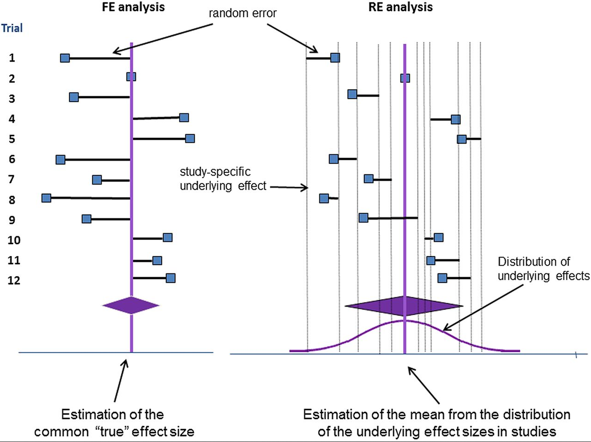
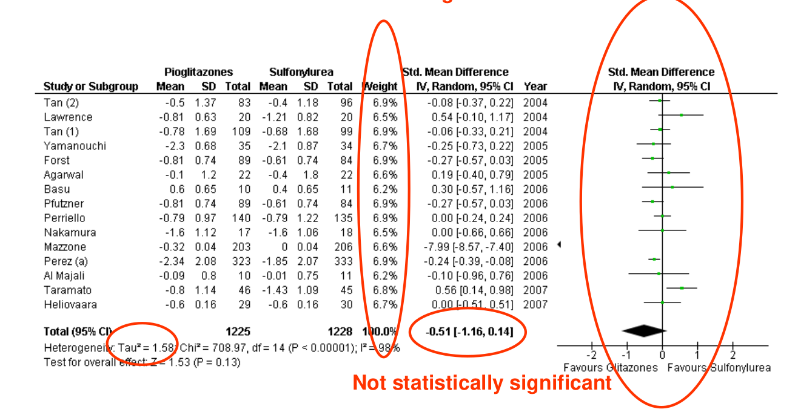

# Evidence synthesis {#evidence}

## Pre-session readings

*Murad, M. H., Montori, V. M., Ioannidis, J. P., Jaeschke, R., Devereaux, P. J., Prasad, K., ... & Guyatt, G. (2014). How to read a systematic review and meta-analysis and apply the results to patient care: users’ guides to the medical literature. Jama, 312(2), 171-179.* [link](https://https://jamanetwork.com/journals/jama/article-abstract/1886196)

*Schulz, K. F., Altman, D. G., Moher, D., & CONSORT Group. (2010). WITHDRAWN: CONSORT 2010 statement: Updated guidelines for reporting parallel group randomised trials.* [link](https://www.bmj.com/content/340/bmj.c332)

## Identifying, aggregating and appraising the evidence

### Identifying the evidence

+ Comprehensive search following accepted search practices will help to:
    + avoid missing relevant studies
    + avoid other potential biases (publication, time lag, language)
    + provide detailed search documentation (aid transparency and increase confidence)

It is impossible to know if you have created the ‘perfect’ strategy and impossible to know if you have captured all the relevant evidence. The goal is to goal should instead be to search as comprehensively as is feasible, providing a balance between sensitivity & specificity. One of the best sources for conduction a systematic review is the [Cochrane Handbook for Systematic Reviews of Interventions](https://training.cochrane.org/handbook).

Prior to the search process the following needs to be clarified:

+ type of research question
+ HTA components required
+ type of studies required
+ Databases

At protocol stage – scoping searching all occurs prior to protocol development so by protocol finalization, search shouldn’t change after this. Search strategy should be described in report in such detail that it can be replicated and updated. You should include:

+ Sources searched 
+ Search strategy used for at least one database
+ Time periods of the search
+ Any limits used

We can consider two types of literature: published and gray literature. It is important to know that an optimal search strategy will not necessarily identify all relevant items. The primary source of published literature are **bibliographic databases**, such as Medline and Embase. Other sources include:

+ Conference abstracts & proceedings
+ Electronically available full-text journals & report
+ Reference lists & citation tracking
+ Google

**Hints**

1. Check through bibliographic references of relevant review articles and/or trials to find references to other potentially relevant trials
2. racking the citations of key studies/papers.

### How to search

Identify key topics and translate into a clearly focused question. Once this is we can create our PICO:

+ P - Population
+ I - Intervention
+ C - Comparator
+ O - Outcome
+ S - Study type

Look at MeSH headings, words in title, abstract or other potentially relevant fields. Medical Subject Headings (MeSH) is a comprehensive controlled vocabulary for the purpose of indexing journal articles and books in the life sciences. Using only the controlled vocabulary that someone else deemed as right for an article is risky (e.g. MeSH). We need to use "free text" or keyword terms to ensure you find all your articles. Free text search words will find the word anywhere you tell it to. Moreover, consider combining body of search with study “filter” in order to restrict to a given study type.

It is crucial to **document your searches**, it allows other researchers to replicate your study. You need to provide details of which databases and interface you searched. Write down how many results you had from each database for inclusion in the Description of Studies or Results section, as well as a PRISMA flow chart.

```{r echo=FALSE, fig.cap="Flowchart PRISMA diagram",fig.align='center'}
knitr::include_graphics("images/PRISMA_flow_diagram.jpg")
```
 
Once you run your search, it is important to use bibliographic software (EndNote, Zotero, etc.)

### Aggregating and appraising the evidence

We are generating new evidence, therefore we need to use systematic approaches which are documented, transparent and reproducible.

Systematic literature review initial steps:

+ Aggregate
+ Abstract
+ Appraise


#### Aggregate

+ Multi-stage documented screening process using pre-defined selection criteria
+ Recommended that this be completed by at least 2 individuals independently
+ Using the a priori criteria

```{r echo=FALSE, fig.cap="Aggregate process",fig.align='center'}
knitr::include_graphics("images/review.png")
```

For reporting tools, follow [PRISMA](http://www.prisma-statement.org/). Finally, the evidence can be categorized in different levels:

1. Systematic review of RCTs.
2. RCTs.
3. Observational studies.
4. Case-series.
5. Experts opinion

Depending on age & type of health technology being evaluated, amount & quality of evidence may vary.

#### Abstract

Develop a data abstraction form to capture:

+ Study characteristics
+ Patient data
+ Intervention information
+ Outcome data

Data is entered into spreadsheet or database for reporting and synthesis.

#### Appraise

Many quality assessment tools exist depending on the type of literature:

+ [RCTs](https://methods.cochrane.org/bias/resources/rob-2-revised-cochrane-risk-bias-tool-randomized-trials)
+ [Observational studies](https://methods.cochrane.org/methods-cochrane/robins-i-tool)
+ [Prognosis studies](https://www.acpjournals.org/doi/10.7326/M18-1376)
+ [Economic evaluation](https://www.nlm.nih.gov/nichsr/edu/healthecon/drummond_list.html)

### Evidence synthesis 

#### Outcome measures

+ Continuous: means
+ Nominal data: proportions
+ Nominal data: ranks

Before conducting a meta-analysis, it is important to define the outcome of interest.

```{r echo=FALSE, message=FALSE, warnings=FALSE, results='asis'}
tabl2 <- " 
| Types of data               | Outcome measures   |
|:-------------------:|:-------------:|
| Continous       | Mean difrerence. Standardized mean diference|
| Dichotomous        | Risk difference. Relative Risk. Odds Ratio         | 
"
cat(tabl2)
```

+ Use mean difference (MD) when studies have comparable outcome measures (i.e. same scale) $m_1 -m_2$
+  Standardized mean diference (SMD) is used when studies use different outcome measurements which address the same clinical outcome (e.g. different instruments to measure pain intensity, anxiety...) $(m_1 -m_2)/sd_p$ where $sd_p= \sqrt{(sd_1+sd_2)/2}$ 
+ Risk difference (RD) $p_1 - p_2$
+ Relative risk (RR) $p_1/p_2$
+ Odds ratio (OR) $\frac{p_1/(1-p1)}{p_2/(1-p2)}$

In general, health practitioners are more familiar to the concept of relative risk than odds ratios. Remember that point estimates may be misleading. therefore uncertainty can be expressed by confidence intervals. 

### Meta-Analysis
 
A meta-analysis is a statistical analysis that combines the results of multiple scientific studies (more than 2 comparative studies). Studies may differ in terms of results or sample size.

+ The results of a study (e.g. effect size) with 1,000 subjects is assumed to be a more precise estimate than an estimate derived from a study
based on 10 subjects.

+ Larger studies should carry more weight than smaller studies

#### Heterogeneity

Patients, interventions or outcomes may differ within and between studies. This is what is called heterogeneity. In order to take into account this heterogeneity, two models have been proposed: fixed effects and random effects models:

+ Fixed effects model: Every study evaluates a common effect size. Variation between studies only due by chance.
+ Random effects model: The effect sizes are different between studies and they follow a distribution.

```{r echo=FALSE, fig.cap="Fixed vs Random effects",fig.align='center'}

```

In the presence of heterogeneity:

+ Ignore heterogeneity
+ Incorporate heterogeneity into a random effects model
+ Explain heterogeneity by sub-group analyses or meta-regressions

Presence of heterogeneity can bedetermined through a chi-squared test. Also, we can calculate a statistic ($I^2$) that describes the percentage of
variation across studies that is due to heterogeneity rather than chance (i.e. how much heterogeneity).

**Which one to use?** Heterogenity can be explained either by:

+ Sub-group analyses
+ Meta regression

#### Example

+ Type 2 Diabetes mellitus management
    + P: Type II DM
    + I: Glitazones
    + C: Sulfonylurea
    + O: HbA1c
    
```{r echo=FALSE, fig.cap="Fixed effects",fig.align='center'}
knitr::include_graphics("images/fixed_example.png")
```  

```{r echo=FALSE, fig.cap="Random effects",fig.align='center'}

``` 