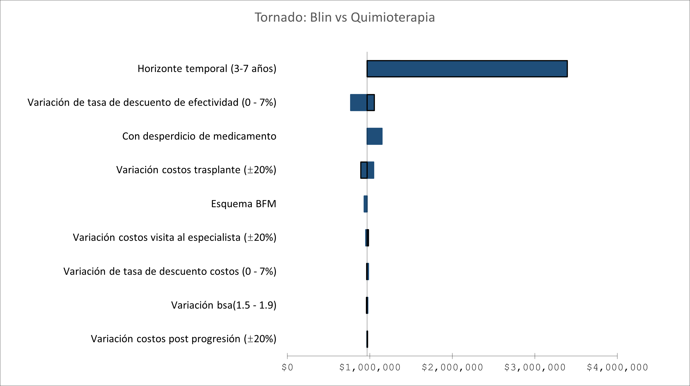

# Uncertainty and decision-making {#uncertainty}

## Pre-session readings

*Edlin, R., McCabe, C., Hulme, C., Hall, P., & Wright, J. (2015). Cost effectiveness modelling for health technology assessment: a practical course. Springer.* Chapters 4, 6 and 7.

*Briggs, A., Sculpher, M., & Claxton, K. (2006). Decision modelling for health economic evaluation. Oxford University Press.*. Chapters 4.1, 4.2 and 4.3.
 
## Introduction

The ultimate purpose of any economic evaluation is to inform decision-making; it is inherently concerned with estimating the expected future costs and outcomes of alternative courses of action; and because it is concerned with the future, uncertainty is a central concern for the analyst. In the context of decision-making, we always are interested to quantify the risk of making a wrong decision. 

**Questions**

1. What do you think I mean of making a wrong decision in the context of HTA?

Decision uncertainty can be thought of as the probability that the decision maker will refuse to pay for a therapy that is good value or agree to pay for a therapy that is not good value. Uncertainty comes in different forms, so it is important to understand the different sources of uncertainty that can impact upon the results of an economic evaluation.

## Sources of uncertainty in cost-effectiveness models

### Sampling variation

RCTs (or even observational studies) come from a subset of the population of interest. Therefore, a different sample from the same population will result in different estimates of efficacy in an experimental study. 

### Generalisability

Generalisability is concerned with the degree of confi dence with which data obtained in one setting can be used to inform a model of what should be expected in a different setting. Generalisability is a particularly acute concern when evaluating technologies close to launch, when almost all evidence is derived from the clinical trial development programme.

**Questions**

2. Think about COVID-19 vaccines. What issues arise with this type of uncertainty?
3. In CEA, what other components are prone to generalisability issues?

### Structural uncertainty

A model structure attempts to describe the relevant clinical pathways for patients treated with the interventions being evaluated. Usually, the simpler the model the better. The question is whether the simplifi -
cations exclude important characteristics of the potential care process that, if included in the model, would be likely to lead to a different decision? 

Methodological choices, and different methods will often lead to different predictions and very different estimates of the uncertainty in those predictions. It is important that the analyst be explicit about the rationale for the modelling strategy adopted, ensuring that the decision maker is aware of any uncertainty that this introduces.

## Variability, heterogeneity and uncertainty

We must distinguish between *variability* (the differences that occur between patients by chance) and *heterogeneity* (differences that occur between patients that can be explained) from decision *uncertainty* – the fundamental quantity that we wish to capture from our decision models.

The best way to explain the difference between these 3 concepts is with a traditional linear regression model, i.e.,

$$
y_i=\beta_0 + \beta_px_{i,p} + \epsilon_i, \space \epsilon_i \sim \mathcal{N}(0,\sigma)
$$

## How to deal with uncertainty?

Different methods have been developed to address uncertainty in CEA. These methods fall under the umbrella term *sensitivity analysis*. Sensitivity analysis is the process of varying model input values and recording the impact of those changes on the model outputs. The next table shows the different ways to handle uncertainty in CEA.

```{r table4, echo=FALSE, message=FALSE, warnings=FALSE, results='asis',fig.cap="Type of sensitivity analysis"}
tabl <- " 
| Type of sensitivity analysis  | Definition    | 
|:-------------------:|:-------------:|
|  One way        | The variation of one parameter whilst all other parameters are held constant to observe the impact on the predicted costs and outcomes           | 
| Multiway        | The variation of more than one parameter whilst all other parameters are held constant to observe the impact on predicted costs and outcomes           | 
| Probabilistic sensitivity analysis     | Using probability distributions to characterise the credible range and the likelihood of any given value being observed, combined with simulation to promulgate the uncertainty in the parameters to uncertainty in the predicted costs and outcomes | 
"
cat(tabl) # output the table in a format good for HTML/PDF/docx conversion
```

### One-way (deterministic) sensitivity analysis

One-way sensitivity analysis examines how the ICER changes in response to changes in a single parameter whilst holding the value of all other model parameters constant. It is helpful to identify which parameters in a model have the strongest direct effect on the model results.

One way to represent this variation is by using tornado diagrams (see Figure \@ref(fig:fig5)).

```{r fig5, echo=FALSE, fig.cap="Tornado diagram",fig.align='center'}

```

### Probabilistic Sensitivity Analysis (PSA) 

PSA requires that each parameter is expressed as a probability distribution. Each input to the model is known with a certain degree of uncertainty. This uncertainty can be characterised as a probability density function with an associated probability
distribution.

Once a probability distribution has been described for each parameter in the cost effectiveness model, PSA allows the analyst to vary the value of each parameter simultaneously. Values are drawn from the probability distributions, and the outputs of the model for each draw are recorded.

#### Distributions for probability parameters

Probability parameters have an important constraint – all probabilities can only take values between the range of zero and one. Furthermore, probabilities of mutually exclusive events must sum to one. 

The beta distribution is a natural choice for representing uncertainty in a probability parameter where the data informing that parameter are binomial. The beta distribution is constrained on the interval 0–1 and is characterized by two parameters, $alpha$ and $beta$. When data are binomially distributed, fitting the beta distribution turns out to be extremely straightforward. If the data are represented by a number of events of interest $r$, observed from a given sample size $n$, the proportion of events to the total sample gives the point estimate of the probability. Uncertainty in this probability can be represented by a beta
$(\alpha,\beta) $distribution, simply by setting $\alpha = r$ and $\beta = n–r$. Let's say that in a RCT, 4 adverse events were present in 20 patients. Therefore, shows the result of fitting a beta(4,16) distribution to the data of the previous example.

```{r}
#define range
p = seq(0,1, length=100)

#create custom plot of Beta distribution
plot(p, dbeta(p, 4, 16), ylab='density',
     type ='l', col='purple', main='Beta Distribution')
```

**Questions**

4. Why not using the normal distribution

Most of the when times when fitting beta distributions to secondary data or meta-analysis results, it may
only be the mean/proportion and standard error/variance that are reported. If this is the case then it is still possible to fit the beta distribution using an approach known as method of moments. Let $\hat{p}$ represents the sample proportion reported for example in a meta-analysis and $\mathbb{se}(\hat{p})$ the standard error associated to it. Then

$$
\alpha=\frac{\hat{p}^2(1-\hat{p})}{\mathbb{se}(\hat{p})^2}-\hat{p}
\quad \beta=\alpha\frac{1-\hat{p}}{\hat{p}}
$$

#### Distributions for relative risks (or odd ratios) parameters

We will use the normal distribution for the log relative risks (odd ratios) (why?). Let's say that we employ data again from a published meta-analysis where the authors  employ a relative risk estimate of 0.51 with a quoted 95% confidence interval of
0.365–0.710. Taking the natural logs of the point and interval estimates generates the following log scale estimates: −0.675
(−1.008, − 0.342). Dividing the range through by 2 × 1.96 recovers the estimate of log scale standard error:

$$
\mathbb{se}(\ln(RR))=\frac{UL-LL}{2*1.96}    
$$

where $UL$ and $LL$ denothe the upper and lower limits of the confidence interval. Now we simply take a random draw from a $\mathcal{N}(−0.675, 0.170)$ distribution and exponentiate the result.

```{r}
#define range
x = seq(-2,2, length=100)

#create custom plot of Beta distribution
plot(x, dnorm(x, -.675, .17), ylab='density',
     type ='l', col='red', main='Normal Distribution')
abline(v=-.675, col="blue")
```

#### Distributions for costs

Just as our choice of distribution for probability data was based upon the range of the data, so it should be noted that cost data are constrained to be non-negative and are made up of counts of resource use weighted by unit costs.

A natural choice is the gamma distribution. The reason is because this distribution is constrained on the interval 0 to
positive infinity. To fit a gamma distribution to cost data we can again make use of the method of moments approach. The gamma distribution is parameterized as $gamma(\alpha,\beta)$. Let $\hat{\mu}$ represents the mean cost and $\mathbb{se}(\hat{\mu})$ the standard error associated to it. Then

$$
\alpha=\frac{\hat{\mu^2}}{\mathbb{se}(\hat{\mu})^2}
\quad \beta=\frac{\mathbb{se}(\hat{\mu})^2}{\hat{\mu}}
$$

As an example, we can consider the direct medical costs associated to a particular state of the model, which
will be $6948 for the purposes of this example. Unfortunately, although this estimate seems to have been taken from a
patient-level cost data set, no standard error was reported. For the purposes of this example, suppose that the standard error is the same value as the mean. Therefore

$$
\alpha = 6948/6948 = 1 \quad \beta = 69482/6948 = 6948
$$

#### Distributions for utilities


A pragmatic approach, often employed when health state utilities are far from zero, is to use a beta distribution. However, this is not appropriate for states close to death where values less than one are possible.

A simple transformation of $D= 1-U$, such that $D$ is a utility decrement or a
disutility provides the solution. This utility decrement is now constrained on the interval 0 to positive infinity and the previous methods of fitting a gamma distribution can be applied.