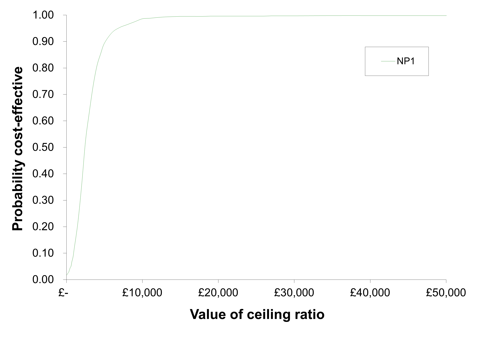

# Presenting results from probabilistic models {#results}

In this chapter, we  explore exactly how probabilistic models, with all parameters being represented by their respective distributions, should be handled in terms of producing, analysing and then presenting the results of
the probabilistic analysis.
 
## Two treatment alternatives

The cost-effectiveness plane  is presented in Figure \@ref(fig:fig2) and shows the difference (treatment minus control) in effectiveness $\Delta E$ per patient against the difference in cost ($\Delta C$) per patient. 

**Questions**

1. What is the interpretation of this plane in terms of being cost-effective or not?

Of course, the above discussion assumes that we know with certainty the cost, effect and cost-effectiveness of an intervention, such that the appropriate decision is clear. In practice, the outputs of our probabilistic models give us the distribution over incremental cost, incremental effect and the joint distribution. Figure \@ref(fig:fig6) shows 1000 Monte Carlo simulations of the output of a decision model.

```{r fig6, echo=FALSE, fig.cap="Estimated joint cost-effectiveness density for a model plotted on the cost-effectiveness plane.",fig.align='center'}
knitr::include_graphics("images/simulacionmc.png")
```

The presentation of the simulated joint density in Figure \@ref(fig:fig6) previous requires that the probabilistic output of our probabilistic models is recorded. As this is a straight forward repetitive process, it can be easily achieved in Excel using simple programs known as `macros`.

### Quantifying uncertainty

Interval estimates can be obtained for outcomes of interest using the simulation results by using the percentile method. This simply involves taking the $\alpha/2$ and $(1 − \alpha/2)$ percentiles of the simulation vector as the $(1 − \alpha)100%$ uncertainty interval for outcomes of interest.

#### Aceptability curves

If the estimated ICER lies below the threshold ratio $\lambda$, reflecting the maximum that decision makers are willing to invest to achieve a unit of effectiveness, then it should be implemented. Therefore, in terms of the Monte Carlo simulations on the cost-effectiveness plane in, we could summarize uncertainty by considering how many of the simulations fall below and to the right of a line with slope equal to $\lambda$, lending support to the cost-effectiveness of the intervention. 

The value of $\lambda$ is itself unknown. However, it can be varied in order to show how the evidence in favour of cost-effectiveness of the intervention varies with $\lambda$.The resulting curve is shown in Figure \@ref(fig:fig7) and has been termed a cost-effectiveness acceptability curve as it directly summarizes the evidence in support of the intervention being cost-effective (i.e. acceptable) for all potential values of the decision rule

```{r fig7, echo=FALSE, fig.cap="CEAC.",fig.align='center'}

```

#### The net-benefit framework

The algebraic formulation of the decision rule for cost-effectiveness analysis that a new treatment should be implemented
only if its ICER lies below the threshold ratio, $\frac{\Delta C}{\Delta E}<\lambda$, can be rearranged in two equivalent ways to give two alternative inequalities on either the cost scale (net monetary benefit, NMB) or on the effect scale (net health benefit, NHB).

$$
\begin{aligned}
 NMB &: \lambda\Delta E - \Delta C>0 \\
 NHB &: \Delta E - \frac{\Delta C}{\lambda}>0
\end{aligned}
$$

By using a net-benefit formulation, we can avoid the problem apparent with ICERs of conflating simulations of the same sign but in opposite quadrants of the cost-effectiveness plane.As such, it turns out to be much simpler to calculate acceptability curves from Monte Carlo simulations using net benefits than using the joint distribution of costs and effects.

## Multiple treatment options

The standard presentation of the CEAC reflects the standard concern of cost-effectiveness analysis with the incremental comparison of an experimental treatment against a comparator treatment. The consequence is that, in a fully specified economic model, there are likely to be more than two treatment alternatives being compared.When this is the case, multiple CEACs can be presented.
