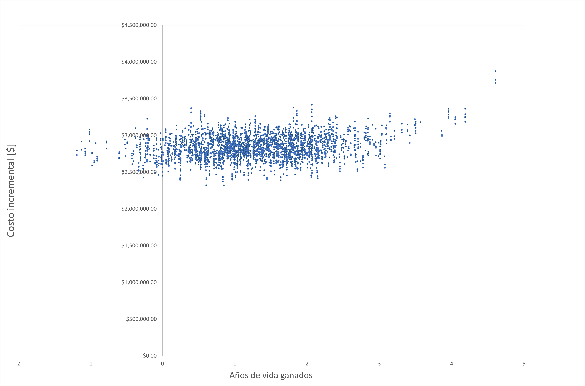

# Presenting results from probabilistic models {#results}

In this chapter, we  explore exactly how probabilistic models, with all parameters being represented by their respective distributions, should be handled in terms of producing, analysing and then presenting the results of
the probabilistic analysis.
 
## Two treatment alternatives

The cost-effectiveness plane  is presented in Figure \@ref(fig:fig2) and shows the difference (treatment minus control) in effectiveness $\Delta E$ per patient against the difference in cost ($\Delta C$) per patient. 

**Questions**

1. What is the interpretation of this plane in terms of being cost-effective or not?

Of course, the above discussion assumes that we know with certainty the cost, effect and cost-effectiveness of an intervention, such that the appropriate decision is clear. In practice, the outputs of our probabilistic models give us the distribution over incremental cost, incremental effect and the joint distribution (see next Figure).

```{r fig6, echo=FALSE, fig.cap="Estimated joint cost-effectiveness density for a model plotted on the cost-effectiveness plane.",fig.align='center'}

```

